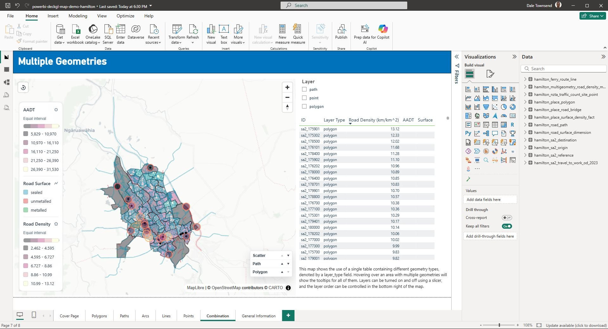

# Power BI deck.gl map custom visual

High-performance Power BI custom visual using [deck.gl](https://deck.gl/) and MapLibre for WebGL map rendering. It supports multiple geometry layers in one visual, row-level styling, numeric colour gradients, geometry-aware legends, custom HTML tooltips with geometry-type icons, selection highlighting, polygon extrusion, and on-map layer ordering. It currently focuses on geometry layers rather than text or icon layers.

## Install

- Download the latest `*.pbiviz` from <https://github.com/Feltzem/powerbi-deckgl-map/releases>
- [Install a custom visual in Power BI](https://learn.microsoft.com/en-us/power-bi/developer/visuals/import-visual#import-a-visual-file-from-your-local-computer-into-power-bi).

## Demo Dashboard

- Download the latest Hamilton demo `.pbix` from <https://github.com/Feltzem/powerbi-deckgl-map/releases>.
- Use the tracked sample CSVs in [`samples/hamilton`](samples/hamilton) if you want to rebuild or inspect the demo data.
- Use [`notebooks/nz_data_for_visual.ipynb`](notebooks/nz_data_for_visual.ipynb) to regenerate the full New Zealand CSV bundle when you want a nationwide demo dataset instead of the Hamilton sample.

The demo dashboard is intentionally Hamilton-sized so it opens quickly and stays below Power BI visual row-window limits, while still showing points, lines, arcs, paths, polygons, a combined multi-geometry map, WKP geometry, numeric gradients, and dynamic hex colour measures. The Hamilton sample remains the tracked default dataset, while the full New Zealand exports can be regenerated from [`notebooks/nz_data_for_visual.ipynb`](notebooks/nz_data_for_visual.ipynb).



## Current Capabilities

- Geometry layers: scatter points, straight lines, arcs, paths, and polygons.
- Scatter heatmaps: render existing scatter points as a heatmap with optional
  point weights, radius, intensity, opacity, threshold, and palette controls.
- H3 hexagon overlays: aggregate scatter points into occupied H3 cells with
  configurable resolution, count-driven fill gradients, count-driven
  transparency, dark grey outlines, joined-point count tooltips, and rounded
  count legends.
- Scatter symbols: choose a layer-wide point shape from circle, square,
  diamond, triangle, inverted triangle, hexagon, pentagon, star, cross, or X
  cross while keeping the existing fill and outline styling.
- Mixed-geometry maps: use one Power BI table with a `Layer Type` field containing `scatter`, `line`, `arc`, `path`, or `polygon`. These layer identifiers can be changed in the Format pane.
- Geometry inputs:
  - Scatter uses `Point1 Latitude` and `Point1 Longitude`.
  - Line and arc use `Point1` and `Point2` latitude/longitude pairs.
  - Path uses WKT or WKP `LineString` / `MultiLineString` geometry.
  - Polygon uses WKT or WKP `Polygon` / `MultiPolygon` geometry.
- Per-row styling: bind width, radius, fill colour, line colour, arc source colour, arc target colour, and polygon extrusion height fields, with Format pane defaults as fallbacks.
- Colour inputs: colour buckets accept `#RGB`, `#RRGGBB`, `#RRGGBBAA`, `rgb(...)`, `rgba(...)`, numeric values, or categorical text values.
- Numeric gradients: numeric colour fields can be mapped through preset gradients with natural breaks, quantile, equal interval, or defined interval classification. Active numeric colour fields render scrollable gradient legends.
- Categorical palettes: non-empty text that is not a valid direct colour and not a strict number is mapped through a qualitative palette such as Modern, Dark, or Neon. Active categorical colour fields render category legends.
- Legend formatting: the `Legend` Format pane card controls colour legend visibility, background opacity, heading/value fonts, classification type text, and colour scale bars. Each legend heading shows the compact geometry-type icon for its layer. Classification type text and colour scale bars apply to numeric legends only.
- 3D camera: polygons can be extruded using a height field or default settings. `Map properties` > `Show 3D buildings` adds OpenStreetMap building extrusions; `3D buildings zoom` controls the zoom level where they appear at full height. When buildings, extruded polygons, or valid arcs are currently rendered, the map automatically tilts to 45 degrees.
- 3D geometry (Z): paths and polygons supplied as 3D WKT (`LINESTRING Z`,
  `POLYGON Z`) or 3D WKP carry a per-vertex Z. Paths float at their baked
  elevation, and 3D polygons render as floating prisms whose base is the ring
  Z and whose height is the `Polygon extrude elevation` measure. Encoding a
  value range as base-plus-height lets features stack into columns (for example
  restriction validity windows along a road). 2D geometry is unchanged. See
  [3D Geometry (Z) and Stacked Prisms](#3d-geometry-z-and-stacked-prisms).
- Time animation: bind a `Timestamp` field (datetime or numeric seconds) and
  use the `Animation properties` card to play a trailing-window animation
  inside the visual. Scatter points form a vertical time-rug whose height comes
  from each row's timestamp (`Max height`), points and paths outside the
  `Trail length` window are hidden, and `Animation speed`, `Play`, and `Loop`
  control playback. While playing, the tooltip shows the current playhead time.
  An optional on-map time slider (`Layer controls` > `Show time slider`) adds
  scrub, play/pause, and a live time label. The card is hidden when no timestamp
  is bound. See [Time-Based Animation](#time-based-animation).
- Tooltips: bind `Tooltip HTML` for custom sanitized HTML tooltips. Multi-layer tooltips follow the current visual layer order and show a compact geometry-type icon in the top-right of each feature section. H3 hexagons show their joined point count from the aggregate cell, separately from the `Tooltip HTML` bucket.
- Interaction: click selection/highlighting, hover highlighting, configurable fade for unselected polygons, reset view, fly-to, and selectable base maps.
- Layer ordering: multi-geometry visuals can reorder layer stacking directly on the map. The compact on-map layer order pane is off by default; turn on `Layer controls` > `Show layer order control` to use it. The visual persists the order with the report.
- Validation: geometry validation is enabled by default and can be turned off in the Format pane once data quality is known.

## Usage

At minimum, add `Geometry ID`, `Layer Type`, and the geometry fields required by the layer type you are drawing. Add optional style fields when you want row-level control; otherwise the visual uses the relevant Format pane defaults.

Because Power BI custom visuals receive one categorical data view, multi-layer maps should be modelled as one combined table. Each row identifies its geometry type with `Layer Type`, and only the fields relevant to that geometry need to be populated.

To render a scatter heatmap, add scatter rows as usual, then turn on `Heatmap properties` > `Show heatmap`. Bind `Heatmap weight` when each point should contribute a numeric amount; otherwise each scatter point contributes equally. Use `Show scatter points` to keep or hide the original point layer while the heatmap is active.

To render H3 hexagons from scatter rows, turn on `H3 hexagon properties` > `Show H3 hexagons`. Each scatter row contributes one point to its H3 cell; only occupied cells render. Use `H3 resolution` to choose the standard H3 cell size. The fill gradient follows joined point count, while the dark grey outline uses the same count-based opacity settings. Hover a hexagon to see its joined point count; the H3 tooltip does not use the `Tooltip HTML` bucket.

## 3D Geometry (Z) and Stacked Prisms

The visual reads a per-vertex Z (height, in metres) from any 3D path or polygon geometry. This is what lets you stack geometry by a time or numeric attribute without any animation — the height is baked into the geometry itself.

### Supplying Z

Z can come from either geometry encoding:

- **3D WKT**: `LINESTRING Z (lon lat z, ...)` or `POLYGON Z ((lon lat z, ...))`. Any 2D WKT (no `Z`) is unchanged.
- **3D WKP**: a WKP string whose dimension header declares 3 dimensions, so every vertex carries `[lon, lat, z]`. 2D WKP is unchanged.

When any vertex of a feature carries a finite Z, the visual switches that layer to read the Z; otherwise it behaves exactly as before. You do not toggle anything — supplying 3D geometry is enough.

### How Z renders per geometry type

- **Paths** float at their baked Z. A `LINESTRING Z` whose vertices share `z = 500` draws the whole line 500 m above the basemap. The Z can also vary per vertex to draw a sloping line.
- **Polygons** become **floating prisms**. The ring's Z is the **base** of the prism, and the `Polygon extrude elevation` field (or the Format pane default) is the **height added on top**. So a polygon with ring `z = 300` and an extrude elevation of `200` renders a prism whose floor is at 300 m and whose roof is at 500 m. A 3D polygon is auto-extruded even if the `Extruded` toggle is off, and the camera auto-tilts to 45° so the prisms are visible.

2D polygons keep the existing behaviour: flat on the ground unless you turn on `Polygon properties` > `Extruded`.

### Stacking geometry by a time or numeric attribute

Because the base and the height are independent, you can encode a value range as a floating block. The pattern that drives the parking-review-style "walls" is:

- Map a feature's start value to the **base Z** (`h0 = (start - min) / (max - min) * MAX_HEIGHT`), baked into the ring.
- Map its span to the **height** (`(end - start) / (max - min) * MAX_HEIGHT`), bound to `Polygon extrude elevation`.

Features that share a footprint but cover **sequential, non-overlapping** value ranges then stack base-to-top into a column — for example, successive validity windows of a parking restriction, or sequential time buckets at the same location. Lay those columns along a road centreline and you get the stacked "Gantt in 3D" look: each restriction version is a prism whose floor and ceiling mark when it was in force, coloured by type or zone via the standard polygon fill (see colour buckets below).

This stacking is **static** — it is baked into the exported geometry and does not depend on the animation playhead. Bind `Polygon fill` to a categorical field (e.g. parking type) for a category legend, or to a numeric measure (e.g. occupancy) for a gradient ramp.

A ready-made example is in [`samples/animation/wkp_road_prisms_sample.csv`](samples/animation/wkp_road_prisms_sample.csv) (generated by [`scripts/gen-wkp-road-prisms.ts`](scripts/gen-wkp-road-prisms.ts)). Import it and bind `geometry_id`, `layer_type`, `wkp`, `polygon_fill`, `polygon_extrude_elevation`, and `tooltip_html`; no Animation card is needed.

## Time-Based Animation

When you bind a `Timestamp` field, the visual can play a smooth, in-visual animation that sweeps a trailing time window across the data — points and paths appear and disappear as the playhead moves, and points rise into a vertical "time rug". Playback runs entirely inside the visual on the GPU, so it does **not** re-query Power BI per frame and stays smooth where a slicer-driven re-query could not.

### Setup

1. Bind the `Timestamp` field. It accepts a **datetime** column or a **numeric** column already expressed in **seconds**. The visual normalises both to Unix seconds and derives a `[t0, t1]` time domain across every bound row. With no timestamp bound, the animation is inert and the `Animation properties` card is hidden, so existing reports are unaffected.
2. Open `Animation properties` and turn on `Play`.

### The Animation properties card

- **Play** — start/stop the in-visual playback loop. The loop advances continuously (independent of the frame rate) using a real-time clock.
- **Loop** — restart from the beginning when the playhead reaches the end; otherwise it stops at the end.
- **Animation speed (sim seconds / real second)** — how much simulated time elapses per real second of playback. `60` means one real second covers a simulated minute.
- **Trail length (seconds)** — the width of the visible trailing window. A feature is visible only when its timestamp falls within `[time - trail length, time]`.
- **Max height (meters)** — the height assigned to the latest timestamp when deriving height from time (see below).

### What animates

- **Scatter points** form the vertical **time rug**: each point's height is `(timestamp - t0) / (t1 - t0) * Max height`, so the newest points sit highest. As the trailing window slides, points outside it are hidden, so the rug sweeps through time. Bind `Scatter radius` and `Scatter fill` to make the rug legible (a sequential fill by time reads as a moving leading edge).
- **Paths** appear and disappear as a whole when their timestamp enters or leaves the trailing window (efficient GPU discard — the layer is not rebuilt per frame).
- **Rows without a timestamp** stay at ground level and remain visible throughout, so static context geometry can share the same table.

Geometry that already carries a **baked Z** (3D WKT/WKP, above) keeps that elevation — the timestamp then only controls trailing-window visibility, not height. So you can mix authoring styles: 2D points whose height the visual derives from time, alongside 3D geometry whose height is baked in.

While the animation is playing, hovering any feature shows the current playhead time at the top of the tooltip (a localized date/time for datetime sources, or the raw value for arbitrary numeric ones).

### On-map time slider

For interactive exploration, turn on `Layer controls` > `Show time slider`. A compact bar appears at the bottom-left of the map with step-back / play-pause / step-forward buttons, a draggable timeline, and a live time label. The slider only shows when a `Timestamp` is bound, and is off by default.

- **Drag the timeline** to scrub directly to any instant; the geometry updates to that moment. Scrubbing pauses playback.
- **Play/pause** on the bar mirrors the `Animation properties` > `Play` toggle (they stay in sync).
- **Step** buttons jump backward/forward by a fraction of the time range.

This slider scrubs the **in-visual playhead** — a GPU frame position. It is deliberately different from the [powerbi-time-slicer](https://github.com/Feltzem/powerbi-time-slicer): the time-slicer applies a Power BI filter that re-queries the data model (good for coarse, cross-page range selection), whereas the on-map slider moves the animation frame smoothly without re-querying. Use the time-slicer to pick the slice of data, and the on-map slider (or `Play`) to move through it.

A ready-made example is in [`samples/animation/wkp_time_animation_sample.csv`](samples/animation/wkp_time_animation_sample.csv) (generated by [`scripts/gen-wkp-testdata.ts`](scripts/gen-wkp-testdata.ts)): a dense scatter rug plus 3D-WKP paths and prisms. For an obvious demo set `Trail length` to `120`, `Animation speed` to `60`, `Max height` to `1500`, and turn on `Loop`.

### Combining with the time-slicer for coarse filtering

The animation loop handles **fine, smooth playback**. To also scrub a **coarse range** (a single day, a zone), add the [powerbi-time-slicer](https://github.com/Feltzem/powerbi-time-slicer) to the page and bind it to the same datetime column. As a filter-based slicer it narrows the rows that reach this visual; the visual recomputes its `[t0, t1]` domain from whatever arrives and animates within that. So the slicer picks the slice of time, and the in-visual loop plays smoothly inside it. (The slicer's own "play" steps via data-model re-queries and is best used for coarse stepping, not frame-by-frame motion.)

Terminology and options closely match deck.gl:

- Scatter - for points. See [ScatterplotLayer](https://deck.gl/docs/api-reference/layers/scatterplot-layer).
- Line - for a straight line from one point to another. See [LineLayer](https://deck.gl/docs/api-reference/layers/line-layer).
- Arc - for an arc from one point to another. See [ArcLayer](https://deck.gl/docs/api-reference/layers/arc-layer).
- Path - for WKT/WKP line strings and multi-line strings. See [PathLayer](https://deck.gl/docs/api-reference/layers/path-layer).
- Polygon - for WKT/WKP polygons and multi-polygons. See [PolygonLayer](https://deck.gl/docs/api-reference/layers/polygon-layer).

All colour fields can take a direct colour string, a numeric value, or categorical text. Numeric values are styled through the matching gradient settings for that geometry and colour channel. Categorical text values are styled through the matching categorical palette setting. Opacity can not be inferred from numeric or categorical values; use an alpha-bearing colour such as `#RRGGBBAA` or `rgba(...)` when data-driven opacity is required.

### Arc styling notes

- `Arc Source color` and `Arc Target color` accept direct CSS/hex colors and preserve any alpha channel present in the bound data.
- Arc opacity always comes from the alpha channel in the bound source/target color field, or from the format pane defaults when no color bucket value is supplied.

### Highlighting/selection

Firstly, you can enable highlighting on hover. Easy, it doesn't change any of the data/selections.

Secondly, you can filter the selected shapes by click. This is two way:

- When you click an item on the map (or multiple by holding down CTRL key), it:
  - Filters any associated visual to these selections.
  - But it _doesn't_ remove the other shapes from the map. Why? Because otherwise you wouldn't be able to click another one (especially for multi-select). So you know what you've clicked, it highlights these in red (or whatever color you choose) - again, especially useful for multi-select.
  - When you click on the map, it resets the selection.
- When you select items in an associated visual, it will filter the map to only show those selected shapes i.e. selection not highlighting. If you already have a selection made at map-level, it will remove these.

## Sample Data

- Public Hamilton demo CSVs: `samples/hamilton/*.csv`
- Hamilton sample manifest: `samples/hamilton/manifest.json`
- Hamilton TLA boundary artifact: `samples/hamilton/statsnz_hamilton_territorial_authority_2023_generalised.geojson`
- Combined Hamilton map table: `samples/hamilton/hamilton_multigeometry_road_density_map.csv`
- Matching Python transform script: `scripts/build_powerbi_table.py`

### 3D Z and animation samples

- Time-animation table: [`samples/animation/wkp_time_animation_sample.csv`](samples/animation/wkp_time_animation_sample.csv) — a dense scatter time-rug with 3D-WKP paths and prisms, for the **Time-Based Animation** section above. Regenerate with `node --import tsx scripts/gen-wkp-testdata.ts`.
- Stacked road-prism table: [`samples/animation/wkp_road_prisms_sample.csv`](samples/animation/wkp_road_prisms_sample.csv) — restriction-style floating prisms stacked by validity window along a road, for the **Stacked Prisms** section above. Regenerate with `node --import tsx scripts/gen-wkp-road-prisms.ts`.

Both generators encode 3D WKP in Node by feeding the embedded WASM the geometry directly (the `@wkpjs/web` bundle is otherwise browser-only); see the script headers for details.

## Future Ideas

Potential future enhancements include satellite basemaps, Power BI standard highlight integration, and additional deck.gl layers such as column layers.

## Developing

- Make sure you're using Powershell 7.
- `pbiviz install-cert` - make sure you install it, may need to run multiple times.
- `pbiviz start`
- in your browser, go to `https://localhost:8080/assets/` - if complains about certs, you may need to install. Or click "go ahead" which will let you dev.
- go to `app.powerbi.com`, enable developer mode, and add a custom visual.

If you update the `@wkpjs/web` version, re-run `npm run generate:wkp-wasm` - we embed the wasm since PowerBI prevents loading it.

Run `npm run check` before publishing changes. It runs linting, TypeScript checks, focused Node tests, and a version-sync check across `package.json`, `package-lock.json`, and `pbiviz.json`.

### Building

- `npm run check`
- `pbiviz package`

### Releasing

To create a new release:

1. Update the version in `pbiviz.json`, `package.json`, and `package-lock.json`.
2. Run `npm run check`.
3. Push a new tag: `git tag v1.x.x && git push origin v1.x.x`.
4. The GitHub Action will automatically build and create a GitHub Release with the `.pbiviz` asset.
5. Refresh `powerbi-deckgl-map-demo-hamilton.pbix` manually in Power BI Desktop and attach it to the same release.

# Power BI Colour Measures, Numeric Gradients, And Categorical Palettes

Every colour bucket in the visual accepts one of three inputs:

1. A text measure or column that returns a CSS/hex colour such as `#RGB`, `#RRGGBB`, `#RRGGBBAA`, `rgb(...)`, or `rgba(...)`.
2. A numeric measure or column that the visual maps through a gradient configured in the Format pane.
3. A text column or measure with categorical values such as `sealed`, `metalled`, and `unmetalled`, mapped through a qualitative categorical palette.

Use a text colour measure when you want exact control over the final colour or opacity from DAX. Use a numeric field when you want the visual to manage the gradient, class breaks, and numeric legend for you. Use categorical text when you want stable colours and a category legend for factor-style fields.

## General Setup

1. Put `Geometry ID` in the visual so Power BI evaluates the colour measure at row level.
2. Bind the geometry-specific colour bucket to either:
   - a text colour measure that returns a colour string, or
   - a numeric measure that returns the value to classify, or
   - a categorical text field such as `road_surface`.
3. If you bind a numeric field, open the matching Format pane card and configure:
   - `Gradient scale`
   - `Classification method`
   - `Class count`
   - `Defined interval`
4. If you bind a categorical text field, open the matching Format pane card and choose the categorical palette:
   - `Modern` is the default balanced dashboard palette.
   - `Dark` uses saturated colours that work well on light basemaps.
   - `Neon` uses bright colours intended for dark basemaps.
5. If you bind a text colour measure, include alpha in the returned value if you want DAX to control opacity as well.

For numeric gradients and categorical palettes, opacity comes from the default opacity setting in the same Format pane card. For direct text colours, any alpha you return in `#RRGGBBAA` or `rgba(...)` is preserved.

## Geometry-Specific Colour Buckets

| Geometry type | Use this bucket for a custom colour measure                     | Use this bucket for a numeric gradient             | Use this bucket for categories      | Format pane card     |
| ------------- | --------------------------------------------------------------- | -------------------------------------------------- | ----------------------------------- | -------------------- |
| Scatter       | `Scatter fill` for point fill, `Scatter line color` for outline | Same buckets; bind a numeric field instead of text | Same buckets; bind categorical text | `Scatter properties` |
| Line          | `(Line) line color`                                             | Same bucket; bind a numeric field instead of text  | Same bucket; bind categorical text  | `Line properties`    |
| Path          | `Path color`                                                    | Same bucket; bind a numeric field instead of text  | Same bucket; bind categorical text  | `Path properties`    |
| Polygon       | `Polygon fill` for fill, `Polygon line color` for outline       | Same buckets; bind a numeric field instead of text | Same buckets; bind categorical text | `Polygon properties` |
| Arc           | `Arc Source color` and `Arc Target color`                       | Same buckets; bind numeric fields instead of text  | Same buckets; bind categorical text | `Arc properties`     |

When a geometry exposes both fill and line colours, you can drive them independently. For arcs, source and target colours are also independent, so you can bind one measure to `Arc Source color` and a different measure to `Arc Target color`.

## Format Pane Options For Numeric Fields

If a colour bucket contains numbers instead of colour strings, the visual maps the visible range to the gradient configured in the matching geometry card:

- `Scatter properties`: separate `Fill ...` and `Line ...` gradient settings.
- `Line properties`: one gradient for `(Line) line color`.
- `Path properties`: one gradient for `Path color`.
- `Polygon properties`: separate `Fill ...` and `Line ...` gradient settings.
- `Arc properties`: separate `Source ...` and `Target ...` gradient settings.

The supported classification methods are `Natural breaks`, `Quantile`, `Equal interval`, `Defined interval`, and `Manual interval`. When a numeric field is active, the visual also renders a matching legend for the active classes.

**Manual interval** lets you define your own class boundaries. Enter comma-separated break values in the *Manual interval breaks* field (e.g. `0, 10, 50, 100, 500`); the visual creates one colour class per gap between adjacent values. Values below the first break fall into the first class; values above the last break fall into the last class. Optionally enter comma-separated hex colours in the *Manual interval colours* field (e.g. `#e41a1c, #ff7f00, #4daf4a`) to assign a specific colour to each class. If fewer colours than classes are provided the last colour repeats. If the colours field is left blank the chosen gradient scale is used. The *Default fill/line opacity* slider applies to manual colours automatically, the same way it does to gradient colours.

## Format Pane Options For Categorical Fields

If a colour bucket contains non-empty text that is not a valid direct colour and not a strict number, the visual maps each label to a fixed qualitative palette and renders a categorical legend.

- `Scatter properties`: separate `Fill categorical palette` and `Line categorical palette` settings.
- `Line properties`: one categorical palette for `(Line) line color`.
- `Path properties`: one categorical palette for `Path color`.
- `Polygon properties`: separate `Fill categorical palette` and `Line categorical palette` settings.
- `Arc properties`: separate `Source categorical palette` and `Target categorical palette` settings.

Palette assignment is deterministic from the category label, so colours stay stable as filters change. If there are more labels than palette colours, colours repeat; the legend shows the first 30 categories and then a `+ N more categories` row.

### Legend Settings

Use the `Legend` Format pane card to tune colour legends on the map. You can show or hide the legend, adjust the panel opacity, and set separate fonts for legend headings and class-value labels. Each legend heading includes a compact geometry-type icon, matching the tooltip section icons. Numeric legends can also show or hide the classification method label and colour scale bar.

Direct text colours such as `#RRGGBB` and `rgba(...)` are still rendered exactly as supplied, but they do not create a legend. Numeric values take priority for a role: if a colour bucket contains any numeric values, that role uses numeric gradient classification rather than categorical colours.

## Simple Custom Colour Measure Example

This is the simplest pattern when you want DAX to return the actual colour used by the visual:

```DAX
Colour Metric =
SELECTEDVALUE ( YourTable[count] )

Custom Colour Hex =
VAR Metric = [Colour Metric]
RETURN
    SWITCH (
        TRUE (),
        ISBLANK ( Metric ), "#D9D9D900",
        Metric >= 1000, "#005BBBF2",
        Metric >= 250, "#66A3E0CC",
        "#EAF3FF66"
    )
```

Bind `Custom Colour Hex` to the relevant colour bucket for the geometry you are drawing:

- `Scatter fill` or `Scatter line color`
- `(Line) line color`
- `Path color`
- `Polygon fill` or `Polygon line color`
- `Arc Source color` or `Arc Target color`

## Simple Numeric Measure Example

If you want the visual to manage the colour ramp instead of DAX, return a number and bind that directly to the same bucket:

```DAX
Colour Metric =
SELECTEDVALUE ( YourTable[count] )
```

Then configure the gradient in the Format pane:

- `Scatter properties`: set `Fill Gradient scale` or `Line Gradient scale`.
- `Line properties`: set `Gradient scale`.
- `Path properties`: set `Gradient scale`.
- `Polygon properties`: set `Fill Gradient scale` or `Line Gradient scale`.
- `Arc properties`: set `Source Gradient scale` or `Target Gradient scale`.

This is the easier option when you want a legend and want to tune classification without editing DAX.

## Simple Categorical Example

Bind a categorical field directly to a geometry colour bucket. For the Hamilton path sample, bind `road_surface` to `Path color` to colour paths by `sealed`, `metalled`, and `unmetalled` and render a categorical legend.

Power BI Desktop text-column binding has been validated for `Path color` using this `road_surface` example. The same categorical parsing, palette, and legend flow is shared by the other colour buckets when Power BI supplies row-level values for those roles.

Then choose the palette in the Format pane:

- `Path properties` > `Categorical palette` > `Modern` for a balanced dashboard look.
- `Path properties` > `Categorical palette` > `Dark` for saturated colours on light basemaps.
- `Path properties` > `Categorical palette` > `Neon` for bright colours on dark basemaps.

## How To Apply This To Each Geometry Type

### Scatter

For points, use `Scatter fill` for the point body and `Scatter line color` for the outline. Each can take a text colour measure, a numeric measure, or categorical text. If you use numeric values, configure the matching `Fill ...` or `Line ...` gradient settings in `Scatter properties`. If you use categorical text, configure the matching categorical palette setting. Use `Scatter properties` > `Symbol type` to choose a layer-wide point shape: circle, square, diamond, triangle, inverted triangle, hexagon, pentagon, star, cross, or X cross.

### Line

For straight line segments, bind a text colour measure, a numeric measure, or categorical text to `(Line) line color`. If the value is numeric, set the gradient in `Line properties`. If the value is categorical text, set the categorical palette.

### Path

For `LineString` and `MultiLineString` paths, bind a text colour measure, a numeric measure, or categorical text to `Path color`. If the value is numeric, set the gradient in `Path properties`. If the value is categorical text, set the categorical palette.

### Polygon

For polygons, use `Polygon fill` for fill colour and `Polygon line color` for the border. You can mix approaches, for example a direct hex fill measure with a numeric outline measure or a categorical fill. If a bucket is numeric, configure the matching `Fill ...` or `Line ...` gradient settings in `Polygon properties`. If a bucket is categorical text, configure the matching categorical palette.

### Arc

For arcs, use `Arc Source color` for the start of the arc and `Arc Target color` for the end. You can return explicit colours from DAX, bind numeric fields and configure `Source ...` and `Target ...` gradients, or bind categorical text and configure `Source ...` and `Target ...` categorical palettes separately in `Arc properties`.

## Worked Example: Arc Colour Measures

The measures below are a worked example for arcs. They keep the colour scale relative to the current filter context, so a small destination subset still spans a full min_color-to-max_color ramp.

### Setup

1. Put `geometry_id` in the visual so each arc evaluates at row level.
2. Use `arc_is_valid = TRUE` as a visual filter if the visual allows it.
3. Bind the source colour bucket to one of the `Arc Source Hex ...` measures.
4. Bind the target colour bucket to one of the `Arc Target Hex ...` measures.
5. Keep using the exported `count` field as the measure input.

### Tuning The Custom Colour Scale

The `Arc Source Hex Custom` and `Arc Target Hex Custom` measures below build a `#RRGGBBAA` colour by blending each channel between a start colour and an end colour:

```DAX
Start + ( End - Start ) * Ratio
```

`Ratio = 0` gives the start colour. `Ratio = 1` gives the end colour. Values between `0` and `1` produce the colours in between.

To set the start and end colours, edit these variables in the measure:

```DAX
VAR StartR = 255
VAR StartG = 255
VAR StartB = 255
VAR StartA = 51

VAR EndR = 0
VAR EndG = 91
VAR EndB = 187
VAR EndA = 242
```

`R`, `G`, and `B` are normal red, green, and blue values from `0` to `255`. `A` is alpha from `0` to `255`, where `0` is fully transparent and `255` is fully opaque. For example, `#005BBB` is:

```DAX
VAR EndR = 0
VAR EndG = 91
VAR EndB = 187
```

If the lightest colour is too pale, make the start colour darker. For example, replace white `#FFFFFF` with pale blue `#DCEBFA`:

```DAX
VAR StartR = 220
VAR StartG = 235
VAR StartB = 250
```

If the darkest colour is not strong enough, make the end colour darker. For example, replace `#005BBB` with deeper blue `#004196`:

```DAX
VAR EndR = 0
VAR EndG = 65
VAR EndB = 150
```

To shift the whole scale darker without changing the start and end colour variables, lift the ratio before using it for RGB:

```DAX
VAR DarkenShift = 0.10
VAR ColourRatio = MIN ( 1, MAX ( 0, Ratio + DarkenShift ) )
```

Then use `ColourRatio` in the red, green, and blue calculations:

```DAX
VAR Red = ROUND ( StartR + ( EndR - StartR ) * ColourRatio, 0 )
VAR Green = ROUND ( StartG + ( EndG - StartG ) * ColourRatio, 0 )
VAR Blue = ROUND ( StartB + ( EndB - StartB ) * ColourRatio, 0 )
```

For the source arc measure, keep the source end lighter by applying the same shift to the scaled source ratio:

```DAX
VAR DarkenShift = 0.10
VAR SourceRatio = MIN ( 1, MAX ( 0, DarkenShift + Ratio * 0.65 ) )
```

To shift the whole scale lighter, move the ratio back toward the start colour instead:

```DAX
VAR LightenShift = 0.10
VAR ColourRatio = MIN ( 1, MAX ( 0, Ratio - LightenShift ) )
```

Use a shift around `0.05` for a subtle change, `0.10` for a clear change, and `0.15` or more when the colours need a stronger push. If you want both ends of the ramp to change, edit the `StartR/G/B/A` and `EndR/G/B/A` variables as well as the ratio shift.

The same start/end channel technique works for any custom text colour measure, not just arcs. Bind the final `#RRGGBBAA` measure to the relevant scatter, line, path, polygon, or arc colour bucket. If you bind a numeric value directly instead, the visual uses the gradient scale selected in the Format pane; use a DAX text colour measure when you need exact arbitrary start and end colours.

### Base Measures

```DAX
Arc Count =
SELECTEDVALUE ( data[count] )

Arc Is Valid =
COALESCE (
    SELECTEDVALUE ( data[arc_is_valid] ),
    FALSE ()
)

Visible Arc Min Log =
VAR VisibleArcs =
    FILTER (
        ALLSELECTED ( data ),
        data[arc_is_valid] = TRUE ()
            && NOT ISBLANK ( data[count] )
            && data[count] > 0
    )
RETURN
    MINX ( VisibleArcs, LN ( 1 + data[count] ) )

Visible Arc Max Log =
VAR VisibleArcs =
    FILTER (
        ALLSELECTED ( data ),
        data[arc_is_valid] = TRUE ()
            && NOT ISBLANK ( data[count] )
            && data[count] > 0
    )
RETURN
    MAXX ( VisibleArcs, LN ( 1 + data[count] ) )

Arc Colour Ratio =
VAR CurrentCount = [Arc Count]
VAR CurrentLog = LN ( 1 + CurrentCount )
VAR MinLog = [Visible Arc Min Log]
VAR MaxLog = [Visible Arc Max Log]
RETURN
    IF (
        ISBLANK ( CurrentCount ) || CurrentCount <= 0,
        0,
        IF (
            ISBLANK ( MinLog ) || ISBLANK ( MaxLog ),
            0,
            IF (
                MaxLog <= MinLog,
                1,
                MAX ( 0, MIN ( 1, DIVIDE ( CurrentLog - MinLog, MaxLog - MinLog ) ) )
            )
        )
    )

Arc Target Hex Custom =
VAR IsValid = [Arc Is Valid]
VAR Ratio = [Arc Colour Ratio]

VAR StartR = 255
VAR StartG = 255
VAR StartB = 255
VAR StartA = 51

VAR EndR = 0
VAR EndG = 91
VAR EndB = 187
VAR EndA = 242

VAR Red = ROUND ( StartR + ( EndR - StartR ) * Ratio, 0 )
VAR Green = ROUND ( StartG + ( EndG - StartG ) * Ratio, 0 )
VAR Blue = ROUND ( StartB + ( EndB - StartB ) * Ratio, 0 )
VAR Alpha = ROUND ( StartA + ( EndA - StartA ) * Ratio, 0 )

VAR Digits = "0123456789ABCDEF"

VAR RedHex =
    MID ( Digits, INT ( Red / 16 ) + 1, 1 )
        & MID ( Digits, MOD ( Red, 16 ) + 1, 1 )
VAR GreenHex =
    MID ( Digits, INT ( Green / 16 ) + 1, 1 )
        & MID ( Digits, MOD ( Green, 16 ) + 1, 1 )
VAR BlueHex =
    MID ( Digits, INT ( Blue / 16 ) + 1, 1 )
        & MID ( Digits, MOD ( Blue, 16 ) + 1, 1 )
VAR AlphaHex =
    MID ( Digits, INT ( Alpha / 16 ) + 1, 1 )
        & MID ( Digits, MOD ( Alpha, 16 ) + 1, 1 )

RETURN
    IF (
        NOT IsValid,
        "#D9D9D900",
        "#" & RedHex & GreenHex & BlueHex & AlphaHex
    )

Arc Source Hex Custom =
VAR IsValid = [Arc Is Valid]
VAR Ratio = [Arc Colour Ratio]
VAR SourceRatio = Ratio * 0.65

VAR StartR = 255
VAR StartG = 255
VAR StartB = 255
VAR StartA = 51

VAR EndR = 0
VAR EndG = 91
VAR EndB = 187
VAR EndA = 174

VAR Red = ROUND ( StartR + ( EndR - StartR ) * SourceRatio, 0 )
VAR Green = ROUND ( StartG + ( EndG - StartG ) * SourceRatio, 0 )
VAR Blue = ROUND ( StartB + ( EndB - StartB ) * SourceRatio, 0 )
VAR Alpha = ROUND ( StartA + ( EndA - StartA ) * Ratio, 0 )

VAR Digits = "0123456789ABCDEF"

VAR RedHex =
    MID ( Digits, INT ( Red / 16 ) + 1, 1 )
        & MID ( Digits, MOD ( Red, 16 ) + 1, 1 )
VAR GreenHex =
    MID ( Digits, INT ( Green / 16 ) + 1, 1 )
        & MID ( Digits, MOD ( Green, 16 ) + 1, 1 )
VAR BlueHex =
    MID ( Digits, INT ( Blue / 16 ) + 1, 1 )
        & MID ( Digits, MOD ( Blue, 16 ) + 1, 1 )
VAR AlphaHex =
    MID ( Digits, INT ( Alpha / 16 ) + 1, 1 )
        & MID ( Digits, MOD ( Alpha, 16 ) + 1, 1 )

RETURN
    IF (
        NOT IsValid,
        "#D9D9D900",
        "#" & RedHex & GreenHex & BlueHex & AlphaHex
    )
```

The same pattern works for other geometry types as well:

- Scatter: bind the final measure to `Scatter fill` or `Scatter line color`.
- Line: bind the final measure to `(Line) line color`.
- Path: bind the final measure to `Path color`.
- Polygon: bind the final measure to `Polygon fill` or `Polygon line color`.
- Arc: bind separate measures to `Arc Source color` and `Arc Target color` when you want different colours at each end.
